# Bottava Robot Predictive Maintenance Demo

This walkthrough tells the end-to-end story of the predictive maintenance solution, moving from platform architecture to business outcomes in the app.

## 1) Architecture Overview

Start with the big picture: external telemetry and case data are ingested with Lakeflow, governed in Unity Catalog, used to train and serve models with Mosaic AI/MLflow, and consumed through dashboards, Genie, and a Databricks App.

## 2) Raw Data Landing in Unity Catalog Volume

Show the source files that feed the pipeline (robot telemetry, site metadata, surgery/case history, and robot assets), all staged in `raw_landing`.

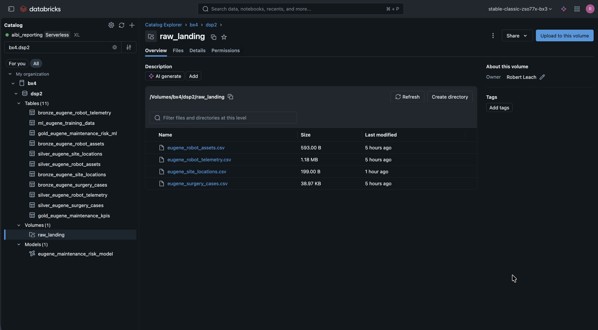

## 3) Lakeflow Pipeline Execution

Demonstrate orchestration from bronze ingest to silver transforms, KPI generation, model evaluation/training, and batch inference. This proves the full production path is automated.

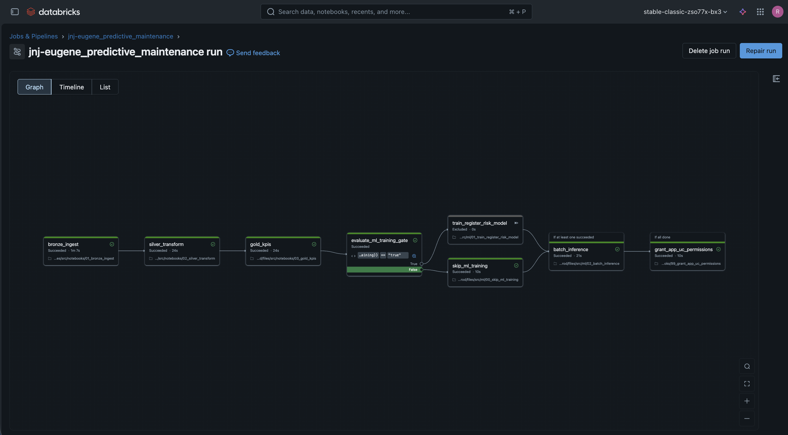

## 4) MLflow Experiment Tracking

Show multiple model candidates being trained and compared in MLflow, highlighting reproducibility and experiment governance.

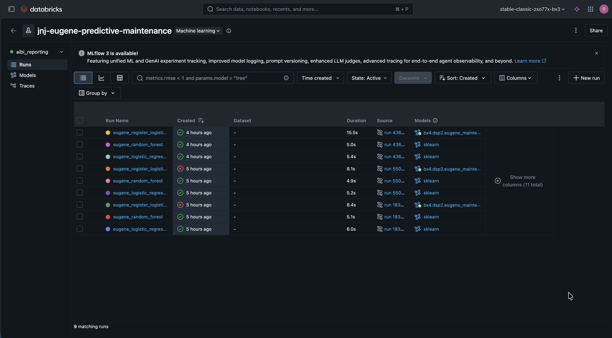

## 5) Registering the Winning Model

Drill into a successful run and point out the registration link to Unity Catalog Model Registry, connecting experiment outputs to deployable artifacts.

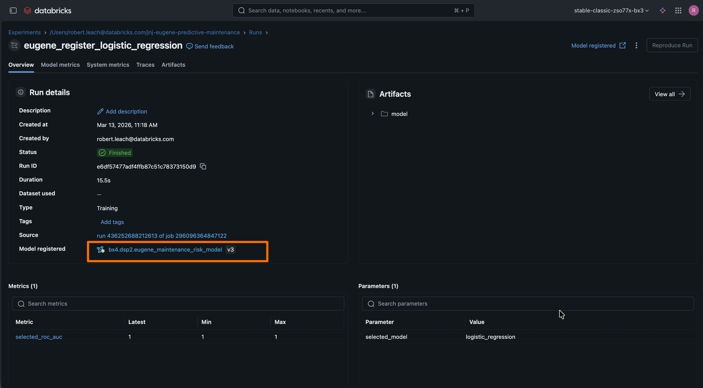

## 6) Model Registry Version Management

Show version history and champion alias management for `bottava_maintenance_risk_model`, emphasizing controlled promotion and lifecycle handling.

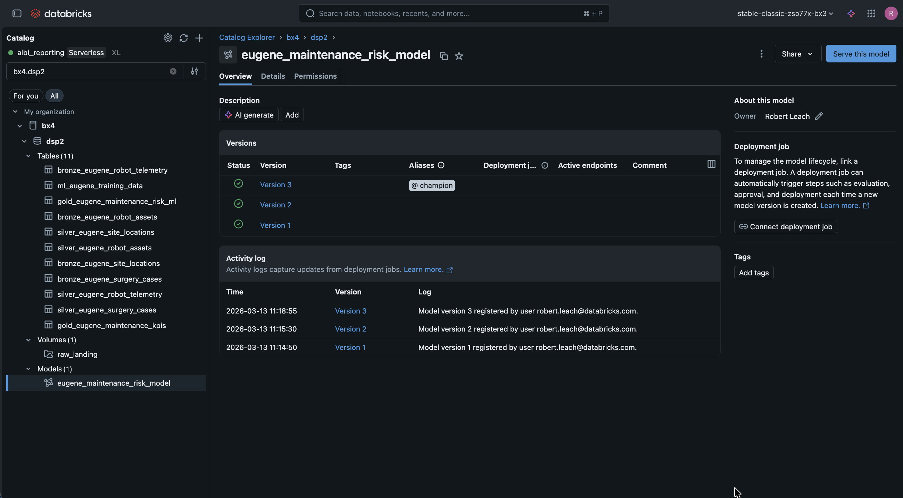

## 7) AI Gateway for Inference Access

Show the AI Gateway endpoint catalog to explain how model/LLM access is centralized with governance and usage controls.

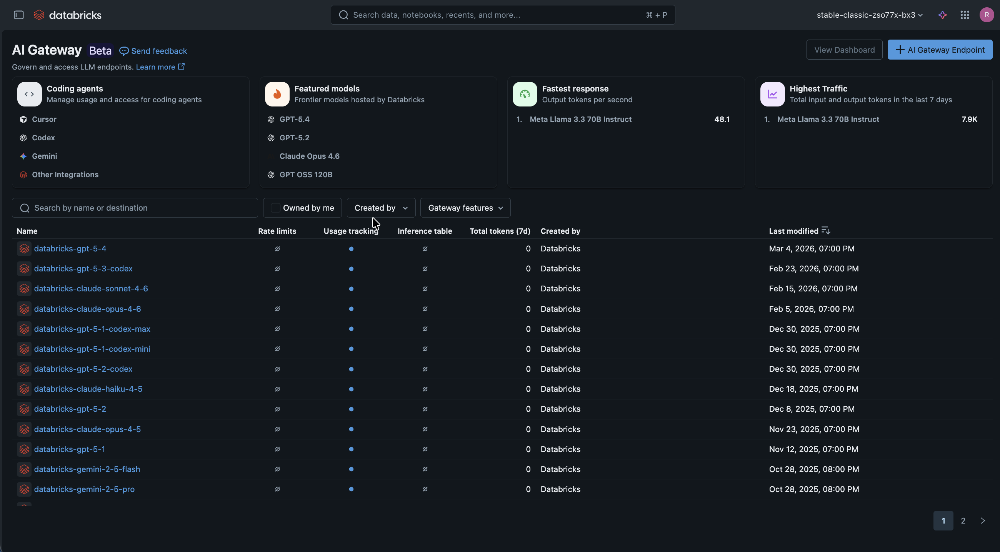

## 8) Executive Dashboard Consumption

Move to business consumption: KPI cards, trend lines, component hotspots, and service queue data provide leadership visibility into fleet health and workload.

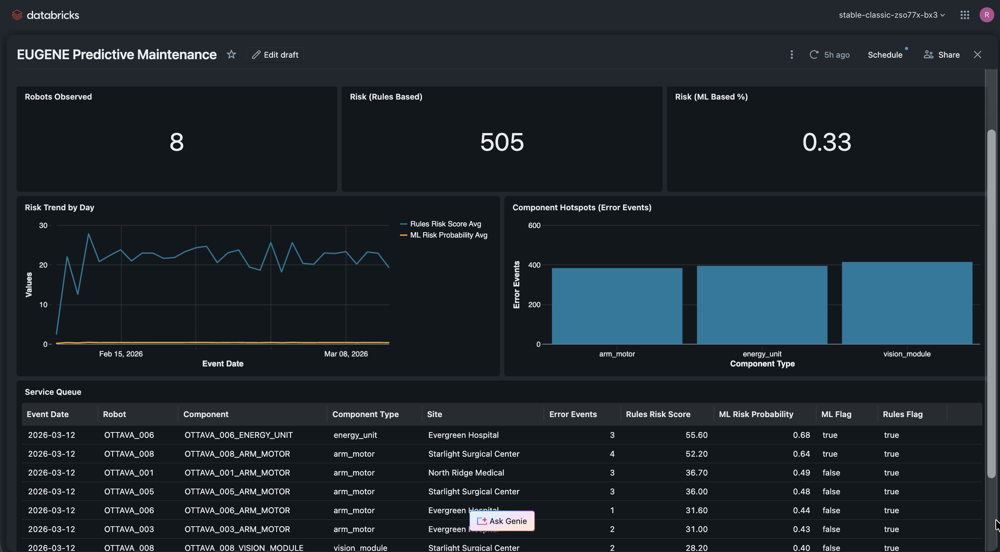

## 9) App Landing: Executive Health Snapshot

Transition to the custom app where operations teams see concise risk posture, fleet coverage, and a prioritized maintenance watchlist.

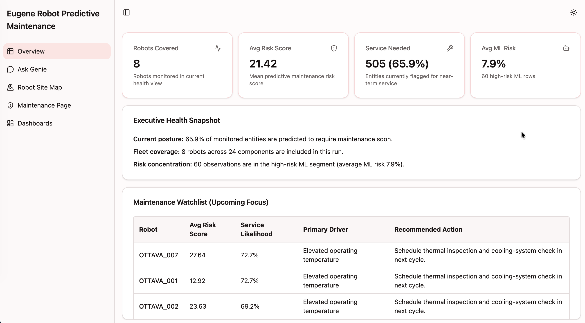

## 10) Ask Genie: Natural Language Investigation

Demonstrate conversational analytics: ask which robots are likely to need maintenance and return ranked reasoning, SQL traceability, and result rows.

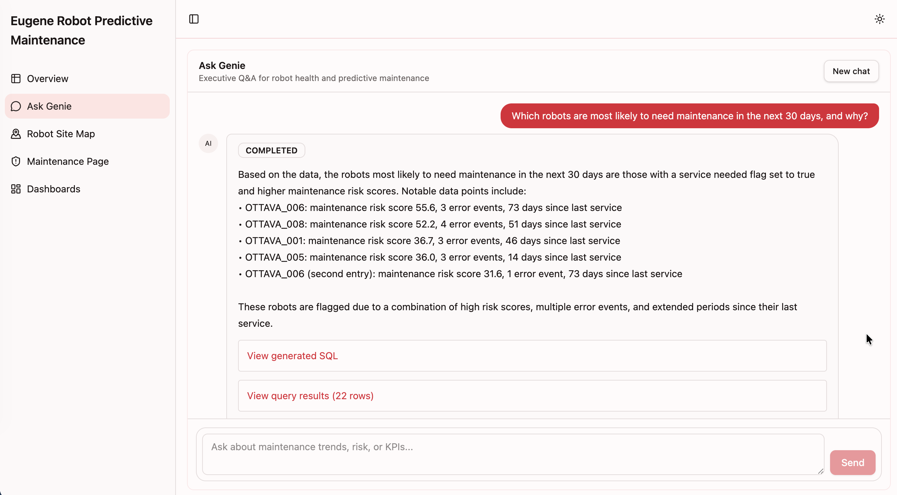

## 11) Site Map: Geographic Risk Context

Show location-aware triage by selecting a site on the map and instantly viewing site-level risk and robot breakdowns.

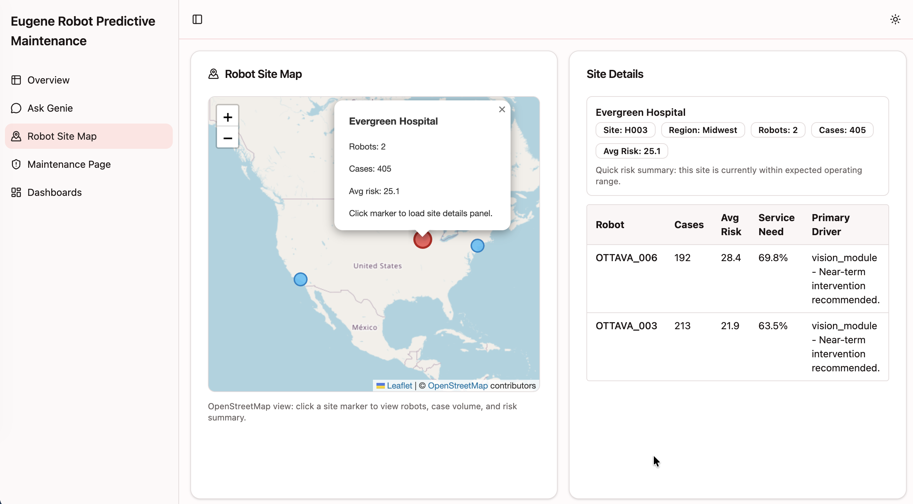

## 12) Maintenance Page: Component-Level Prioritization

Focus on a specific robot: the component heatmap and ML risk scores isolate pressure points (for example, arm motor and vision module) to guide technician action.

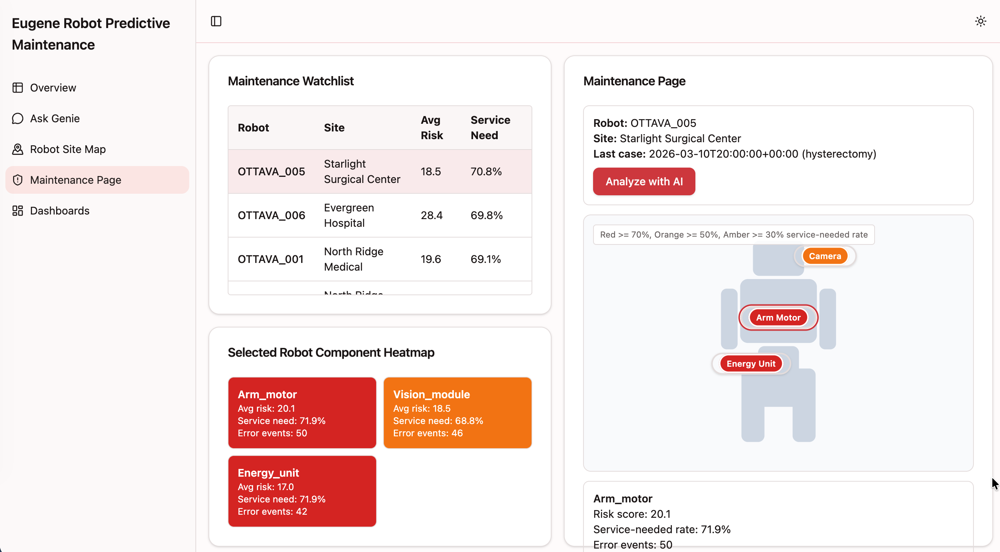

## 13) AI Maintenance Analysis: Recommended Actions

Finish with the AI copilot interpretation layer: plain-language explanation of risk, immediate recommended actions, and what to monitor next for proactive intervention.

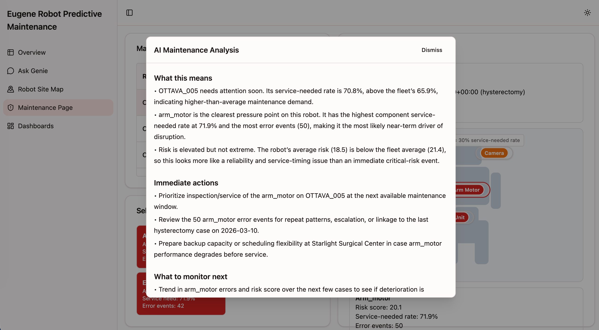

---

## Suggested Talk Track (1-2 minutes)

We ingest operational robot and clinical context data, curate it through a governed medallion pipeline, and continuously train and register predictive risk models. Those model outputs power both executive dashboards and an operator-facing app. The app supports fast triage through KPIs, geospatial drill-down, component-level risk heatmaps, and AI-generated maintenance recommendations, reducing reactive failures and improving service planning.
