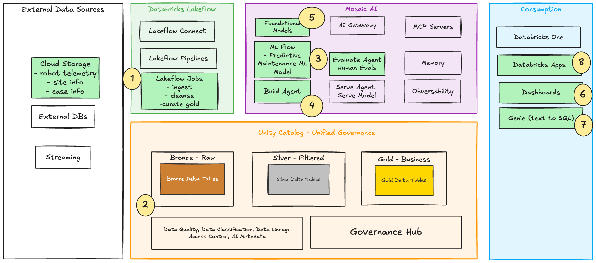

# BOTTAVA Predictive Maintenance Demo

This project is a Databricks solution that builds predictive maintenance KPIs for robotic surgery assets and exposes insights through:

- a Databricks workflow for bronze/silver/gold data processing and optional ML training
- a Databricks AI/BI dashboard for KPI visualization
- an APX Databricks App (FastAPI backend + React frontend) for summary analytics and Genie chat



## Repository overview

- `databricks.yml` - root Databricks Asset Bundle config (jobs, dashboard, app)
- `resources/jobs.yml` - workflow definition (ingest -> transform -> KPIs -> optional ML -> inference)
- `resources/dashboards.yml` - AI/BI dashboard resource
- `resources/apps.yml` - Databricks App resource (APX app build artifact)
- `src/notebooks/` - notebook pipeline stages
- `src/ml/` - ML training and batch inference notebooks
- `apx-app/` - APX application source

## What the pipeline does

1. `01_bronze_ingest.py` loads CSVs from `/Volumes/<catalog>/<schema>/<volume>/` into bronze Delta tables.
2. `02_silver_transform.py` applies standardization and quality filtering.
3. `03_gold_kpis.py` builds `gold_bottava_maintenance_kpis`.
4. Workflow gate checks `run_ml_training`:
   - `true`: run model training/registration, then batch inference
   - `false`: skip training and still run batch inference

## Prerequisites

- Python 3.11+
- `uv` installed ([https://docs.astral.sh/uv/](https://docs.astral.sh/uv/))
- Databricks CLI installed and authenticated
- Access to a Databricks workspace, SQL warehouse, and Genie space

## Installation

### 1) Clone and enter the repo

```bash
git clone <repo-url>
cd jnj-bottava-robot-predictive-maintenance
```

### 2) Install APX app dependencies

```bash
cd apx-app
uv sync --all-groups
uv run apx bun install
cd ..
```

### 3) Verify Databricks authentication

```bash
databricks auth profiles
```

## Configure bundle variables

Defaults are defined in `databricks.yml`:

- `catalog` (default `bx4`)
- `schema` (default `dsp2`)
- `volume` (default `raw_landing`)
- `warehouse_id`
- `genie_space_id`
- `run_ml_training` (default `"false"`)

Override values at deploy/run time with `--var`, for example:

```bash
databricks bundle deploy -p <profile> --var "catalog=<catalog>" --var "schema=<schema>"
```

## Deploy to Databricks

Deploy all resources (job, dashboard, app):

```bash
databricks bundle deploy -p <profile> --auto-approve
```

Start/redeploy the APX app resource:

```bash
databricks bundle run jnj_dsp2_gold_genie_app -p <profile>
```

Run the workflow job:

```bash
databricks bundle run jnj-bottava_predictive_maintenance -p <profile>
```

## Local APX development

From `apx-app/`:

```bash
uv run apx dev start
```

Useful commands:

```bash
uv run apx dev status
uv run apx dev logs -f
uv run apx dev check
uv run apx dev stop
```

Build app artifacts locally:

```bash
cd apx-app
uv run python -m apx build
```
