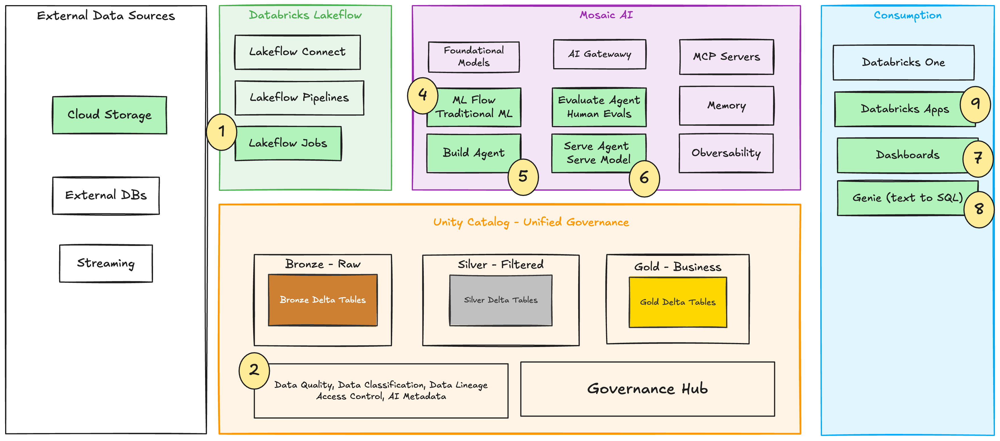

# jnj-dsp2: EUGENE Predictive Maintenance Demo

This project is a Databricks solution that builds predictive maintenance KPIs for robotic surgery assets and exposes insights through:

- a Databricks AI/BI dashboard (`EUGENE Predictive Maintenance`)
- a Databricks App (`jnj-dsp2-gold-genie`) with a gold summary and Genie chat



## What this app does

- Ingests telemetry, surgery case, and robot asset CSV files from a Unity Catalog Volume.
- Transforms data through bronze and silver layers into a gold KPI table.
- Computes maintenance risk signals (for example, `maintenance_risk_score` and `service_needed_flag`).
- Optionally trains/registers an ML model and runs batch inference in the same workflow.
- Publishes results to a dashboard and an APX-based Databricks App for interactive analysis.

## Repository structure

- `databricks.yml` - bundle config, variables, and deployment target
- `resources/jobs.yml` - end-to-end workflow (bronze -> silver -> gold -> optional ML -> inference)
- `resources/dashboards.yml` - AI/BI dashboard resource definition
- `resources/apps.yml` - Databricks App resource definition
- `src/notebooks/` - bronze/silver/gold transformation notebooks
- `apx-app/` - full-stack APX app (FastAPI backend + React frontend)

## Data pipeline flow

1. `01_bronze_ingest.py` loads source CSV files from `/Volumes/<catalog>/<schema>/<volume>/` into bronze Delta tables.
2. `02_silver_transform.py` standardizes types, cleans records, and applies quality filters.
3. `03_gold_kpis.py` aggregates telemetry and case usage to produce `gold_eugene_maintenance_kpis`.
4. Workflow gate checks `run_ml_training`:
   - `true`: train/register model, then run batch inference
   - `false`: skip training, still run batch inference

## Key bundle variables

- `catalog` (default: `bx4`)
- `schema` (default: `dsp2`)
- `volume` (default: `raw_landing`)
- `warehouse_id` (SQL warehouse for dashboard/app)
- `genie_space_id` (Genie space used by app chat tab)
- `run_ml_training` (set to `"true"` to execute model training task)

## Deploy and run

Deploy resources:

```bash
databricks bundle deploy -p <your-profile>
```

Run the workflow:

```bash
databricks bundle run jnj-eugene_predictive_maintenance -p <your-profile>
```

## Local app development (APX app)

From `apx-app/`:

```bash
uv run apx dev start
```

Useful commands:

```bash
uv run apx dev status
uv run apx dev logs -f
uv run apx dev check
uv run apx dev stop
```

## Notes

- The README references `solution_arch.png` at the repository root.
- If the image is stored elsewhere, update the Markdown path accordingly.
